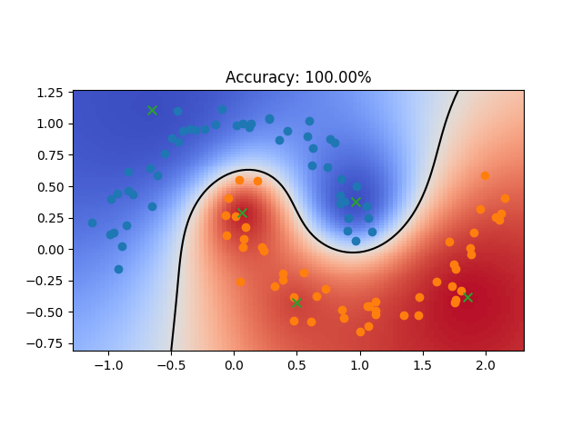

# Visualize the training of an RBF network
Train an RBF network on different datasets (options: moons, circles, linear, and, or, xor). The number of hidden units determines how many prototype vectors are fitted. The prototype vectors can be trained with backpropagation, initialized using k-means centroids or using random training samples. Usually, RBF networks initialize the prototype vectors with random training samples or k-means centroids but the backpropagation option shows that prototype vectors can also efficiently be trained using backpropagation. If the learning rate is too high, training might become unstable but this could potentially be solved by adding adaptive gradient scaling.



Green `x` markers show the prototype vectors of the RBF network and the black line shows the decision boundary.

## Usage
```
rbfn.py [-h] [-d {moons,circles,linear,and,or,xor}] [-nh HIDDEN_UNITS]
        [-lr LEARNING_RATE] [-n N_SAMPLES]
        [-po {backpropagation,kmeans,random}]


optional arguments:
  -h, --help            show this help message and exit
  -d {moons,circles,linear,and,or,xor}, --dataset {moons,circles,linear,and,or,xor}
                        the dataset used for training
  -nh HIDDEN_UNITS, --hidden_units HIDDEN_UNITS
                        the number of hidden units (number of prototype
                        vectors)
  -lr LEARNING_RATE, --learning_rate LEARNING_RATE
                        the learning rate used in the gradient descent steps
  -n N_SAMPLES, --n_samples N_SAMPLES
                        the number of training samples
  -po {backpropagation,kmeans,random}, --prototype_optimization {backpropagation,kmeans,random}
                        the optimization/initialization technique for the
                        prototype vectors
```
